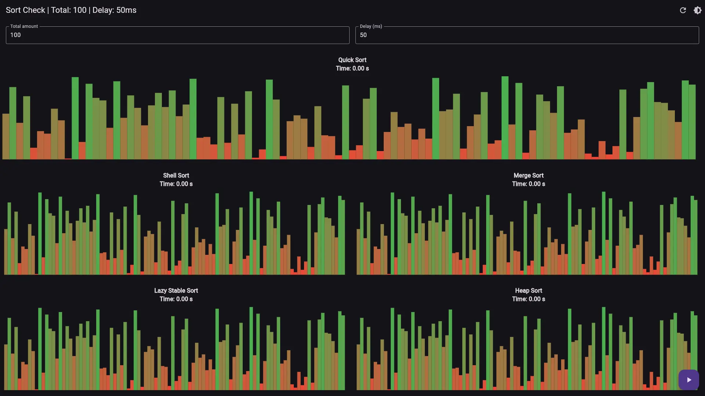

# 🎉 Real-Time Sort Visualization 🎉

Welcome to the Real-Time Sort Visualization project! This tool showcases various sorting algorithms with interactive visualizations. Here’s what you can expect:

- 🔄 **Five Sorting Algorithms** with O(n log n) time complexity
- ⏱️ **Execution Time Tracking** for each algorithm
- ⚙️ **Adjustable Settings**: Delay duration and number of elements to sort

The project is ready for setup on both Windows and web environments. For web deployment, please check the previous commit for the web folder, as it was removed for Firebase hosting setup. Setting up on Firebase is straightforward—just follow their tutorial.

If you need further details or have specific requirements, feel free to ask!

## 📸 Screenshots:

### 🏠 Visualization View:

### 🚀 Getting Started:

1. **Install IntelliJ IDEA**: Download and install [IntelliJ IDEA](https://www.jetbrains.com/idea/download/) from the official website.

2. **Set Up Dart and Flutter Plugins**:

   - Open IntelliJ IDEA.
   - Go to **File > Settings**.
   - Navigate to **Plugins**.
   - Search for and install the **Dart** and **Flutter** plugins.

3. **Install Dependencies**: Make sure you have the Flutter SDK and Dart installed.

4. **Run the Project**: Follow the instructions in the setup guide.

Enjoy exploring and visualizing sorting algorithms with ease! 🌟
